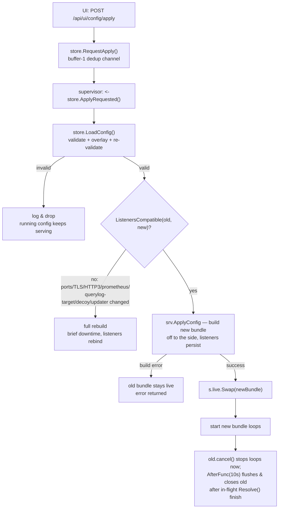

# JungleBlock Architecture

How JungleBlock works internally. This page traces a DNS query from the wire to
the answer, then covers the subsystems that make it an appliance: the noise
engine, the zero-downtime config hot-swap, and the query-log store.

JungleBlock is a **privacy-first DNS appliance** — a resolver, blocker, and
appliance, **not a DHCP server**. It is a hard fork of
[blocky](https://github.com/0xERR0R/blocky) by 0xERR0R (Apache-2.0). The Go
module path stays `github.com/0xERR0R/blocky`, so every import and code example
below legitimately shows that path; only the product and command naming is
JungleBlock (binary `jungleblock`).

For setup see [deployment.md](./deployment.md), for config keys see
[configuration.md](./configuration.md), and for HTTP endpoints see
[api-reference.md](./api-reference.md). The [README](../README.md) has the
quick tour.

---

## The query pipeline

### Recursive-from-root

The default resolution strategy is **iterative recursion from the root
servers** (via `zmap/zdns`) with **DNSSEC validation on** — bogus answers
become SERVFAIL. A recursive group needs **no upstreams** to function.

If upstreams *are* configured on a recursive group, they act as a
**`parallel_best` fallback tier** used **only on recursion failure** — never on
a clean NOERROR/NXDOMAIN, never on a DNSSEC-bogus result. The seed config makes
the default group recursive with Quad9 (`9.9.9.9` / `149.112.112.112`) as that
fallback tier.

The zdns cache lives behind an atomic pointer and is swapped wholesale on
flush: new lookups get a fresh cache, in-flight lookups keep the old one.

### Encrypted upstreams (DoH / DoT)

Transport is inferred from the upstream URL scheme:

| Scheme | Transport | Notes |
|---|---|---|
| `tls://` | DoT (DNS-over-TLS) | default port inferred |
| `https://` | DoH (DNS-over-HTTPS) | default port inferred |
| (plain) | UDP/TCP | — |

Two encrypted-transport hardening options are available, both **off by
default**:

- **EDNS(0) padding** (RFC 7830) — pads queries to blunt size-based analysis.
- **DNS 0x20 query-case randomization** (draft-vixie) — randomizes the case of
  the query name as an anti-spoofing measure.

### Upstream strategies (per group)

Each named group runs one strategy. The `UpstreamTreeResolver` holds one branch
resolver per group and is the tail of the chain.

| Strategy | Behavior |
|---|---|
| `recursive` | Iterative from root, DNSSEC-validated (see above) |
| `parallel_best` | Races 2 upstreams, returns the fastest; 60s per-upstream health window; supports `weighted_random` selection |
| `strict` | Tries upstreams in order |
| `round_robin` | Rotates across upstreams |
| `time_hop` | Time-based rotation |
| `domain_shard` | Shards by domain |

Per-group upstreams can be swapped live without a rebuild (see
[hot-swap](#config-store-hot-swap-zero-downtime)).

---

## The resolver chain

Every query flows through a single chain, built once per config apply. `OnRequest`
loads the live bundle **once per query** via an atomic pointer, so a query uses
one coherent chain even if an apply swaps mid-flight.

Order, top to bottom:

| # | Resolver | Role |
|---|---|---|
| 1 | `StatsResolver` | counters |
| 2 | `RateLimitingResolver` | keyed on connection source IP (deliberately above ECS/client-name) |
| 3 | `ECSClientResolver` | may adopt ECS subnet as internal client IP |
| 4 | `ClientNamesResolver` | reverse-DNS naming; checks custom DNS + hosts first |
| 5 | `FilteringResolver` | query-type filtering |
| 6 | `FQDNOnlyResolver` | FQDN-only enforcement |
| 7 | `EDEResolver` | Extended DNS Errors |
| 8 | `QueryLoggingResolver` | the query-log tap |
| 9 | `MetricsResolver` | Prometheus |
| 10 | `customDNS` | static records |
| 11 | `hostsFile` | hosts-file records |
| 12 | `RebindingProtectionResolver` | inspects resolved/cached answers only |
| 13 | `BlockingResolver` | denylist/allowlist enforcement |
| 14 | `dnssecResolver` | validates **before** caching |
| 15 | `cachingResolver` | cache |
| 16 | `DNS64Resolver` | synthesis after caching |
| 17 | `ECSResolver` | EDNS Client Subnet |
| 18 | `condUpstream` | conditional forwarding (reverse-DNS / local names to a router) |
| 19 | `SpecialUseDomainNamesResolver` | SUDN (RFC 6761) |
| 20 | `upstreamTree` | tail — dispatches to the per-group strategy resolver |

One fork-specific wiring detail: shadow-completion of blocked queries
(`Blocking.ShadowBlockedQueries`) is gated on the noise engine being enabled —
without cover traffic running, completing blocked lookups would leak them
uncovered.

---

## Blocking, groups, and clients

Blocking config lives in `config.db` typed tables that **replace** the YAML
blob's denylists/allowlists/client-groups entirely — but **only in sqlite
query-log mode** (the default appliance mode; see
[why sqlite is load-bearing](#a-note-on-sqlite-mode)).

### Tables

- **`blocking_category`** — one row per embedded blocklist category
  (blocklistproject), with `Enabled` + `IsDefault`. Seeded on first open.
- **`blocking_client_segment`** — assigns categories to a client by
  **name / IP / CIDR**. A client with segment rows gets exactly those
  categories instead of the global enabled set (blocky's native client-group
  semantics).
- **`allowlist_entry` / `denylist_entry`** — manual always-allow / always-block
  entries, grouped (default group `"manual"`).

**Default-on categories** (keeps a fresh box ~100 MB, not ~540 MB):
`ads, tracking, phishing, scam, ransomware, fraud`. The giants (malware,
abuse, porn) and content filters stay opt-in.

### The overlay transform

On load, `overlayBlocking` turns those tables into a blocky config:

- Each enabled or segment-referenced category becomes a denylist group backed
  by a `blocklist:<cat>` file source, streamed from the query-log DB by the
  list loader.
- Segments become `ClientGroupsBlock[client] = [categories...]`.
- Manual deny/allow entries become inline text-source groups. An allow-only
  group gets an empty deny source so it doesn't flip blocky into
  allowlist-only mode.
- Manual (non-category) groups apply to **everyone** — the default group and
  every segmented client.

Every typed mutator (`SetCategoryEnabled`, `SetClientSegment`,
`AddAllow/DenyEntry`) validates its candidate by overlaying onto the blob and
running the full config validation **before persisting** — nothing invalid
ever lands.

### Household groups (named policy bundles)

**Household groups** are named policy bundles assigned to devices by
**name / IP / CIDR (no MAC** — the resolver matches on name/IP/CIDR only).
They map onto `blocking_client_segment`. Enable/disable is live with **zero DNS
downtime** via the hot-swap path below.

### Lists screen

The Lists screen lets you add your own blocklist (adlist) URLs plus a per-entry
enable toggle and comment on allow/deny entries. Entry types
(**exact / wildcard `*.` / regex `/…/`**) are auto-derived from the domain
syntax by blocky's list parser.

---

## The noise / cover-traffic engine

The noise engine emits **indistinguishable decoy DNS** so an on-path observer
cannot profile which lookups are real. Config lives under `privacy.decoy.*`,
**off by default**, `queriesPerMinute: 4`.

It runs only in sqlite mode (it needs the persistent decoy source). Decoys are
resolved through `s.resolve` — the **same live bundle read per call** — so a
decoy always traverses the current chain, with the same group strategy and
recursion as a real query, even across a config swap.

### Why the decoys are indistinguishable

The whole design is about removing every "tell" that would let an observer
separate decoy from real:

- **Same egress path.** Every decoy runs through the real resolver chain,
  flagged `Bypass` (skip cache) + `Decoy` (excluded from dashboards and
  aggregates). Same wire path, same upstreams as real traffic.
- **Poisson timing, never a fixed tick.** Inter-arrival times are exponential
  around the effective rate. A clean periodic tick would itself be a
  fingerprint.
- **Compensating persona cover.** Decoy rate is
  `max(0, targetCurve(t) − recentRealQPM)`, so **total egress tracks a generic
  household diurnal curve** regardless of real activity — hiding the *level* of
  activity, not just which queries are real, and **never delaying a real
  query**. (Honest residual: real usage above the curve's peak ceiling still
  spikes the total.)
- **Never gates to zero.** Off-hours drop to an always-on floor, and window
  edges get per-day jitter so there is no clean on/off step.
- **Real texture, not synthetic templates.** A three-way weighted mix of recent
  real-query replay (7-day), an all-time corpus, and the static Tranco-1M list.
  Replayed queries are **mutated** so they are never byte-identical echoes.
- **Recorded page-load cohort replay.** Replays a whole *real* recorded page
  cohort with its real per-member timing (including blocked members, primary
  first), jittering sub-resource offsets and occasionally splicing one
  unrelated companion — so no two replays are identical while the page-load
  shape stays real.
- **Session coherence.** Walks a topically-plausible successor chain rather than
  emitting isolated names.
- **Realistic miscellany.** Companion clusters mimicking sub-resource loads;
  device chatter (connectivity/NTP/telemetry heartbeats); NXDOMAIN/miss chaff
  under real parents and likely-dead TLDs so decoys don't always resolve;
  browser-style A+AAAA dual-stack pairs; shadow-TTL suppression so a name never
  re-appears before its own observed TTL (which would be a tell).
- **Per-client persona attribution.** Stamps a sampled real client's IP and
  (optionally) that client's EDNS/OPT wire shape onto chaff, with stable
  per-client EDNS cookies and pseudo-client rotation over a split-IP pool.
- **Device-class shaping.** IoT-classed clients beacon low-diversity to fixed
  vendor telemetry clouds (including phantom vendors to obscure the real
  fleet); server-classed clients hit registries/mirrors/updates — not human
  browsing.
- **Safety net.** A domain the box would itself block never egresses as chaff
  (a single-chokepoint exact-match guard, fail-open so cover never stalls).
- **Adaptive back-off.** Throttles the decoy rate under upstream strain.

The engine watches real traffic through the query-log hub tap and **drops
decoy-flagged events** from its own feedback so real-QPS accounting stays
honest. Metric: `blocky_decoy_queries_total`.

---

## Config-store hot-swap (zero-downtime)

This is the standout engineering feature: applying a config change rebuilds the
resolver **without dropping the listeners** — no downtime, no missed queries.

### The store

`config.db` is SQLite (WAL, single connection). It holds a **single-row
raw-YAML blob** — the source of truth — **plus** typed section tables (upstream
groups, blocking, auth) that **overlay** the blob on load. Auth lives in its
own table, never the blob, so a raw-config save can't clobber it.

Loading runs the full validation pipeline (`LoadFromYAML` →
defaults/strict-unmarshal/migrate/validate), applies the overlays, then
**re-validates the merged config**. Raw-YAML writes serialize against section
writes under one mutex.

Applying is signalled by `RequestApply()` — a **non-blocking, de-duplicated**
send on a buffer-1 channel. The supervisor listens on `ApplyRequested()`.
`Status()` reports a `dirty` flag by comparing the blob's `updated_at` against
`lastApplied`.

### The supervisor and the apply path

The **inner event loop** handles one running server: an apply request triggers
a load; an invalid config is logged and dropped while the running config keeps
serving. `ListenersCompatible` then decides the path.

The **outer rebuild loop** binds fresh listeners. A normal (compatible) apply
never reaches it. On a build failure of a *new* config it **rolls back to
`lastGood`** so the box is never left serving nothing.

### The atomic bundle swap

The `resolverBundle` is everything an apply rebuilds — the chain, cfg, upstream
tree, per-bundle context, IO closers, query-log flushers, decoy engine, list
updater, prewarm worker. It is published behind an atomic pointer and is
**read-only after publication**.

What is **persistent** — built once, never in the apply path:

- DNS and HTTP listeners
- the HTTP router
- the query-log hub (SSE)
- the decoy source
- the stats reader

`ApplyConfig` builds the new bundle off to the side on a per-apply child
context:

1. On **any build error**, the old bundle stays live and the error returns.
2. On **success**, swap the atomic pointer, start the new bundle's background
   loops, then **retire the old**: `cancel()` stops its loops immediately, and
   a 10-second `AfterFunc` flushes its query-log buffers and closes its DB/IO
   **after** in-flight `Resolve()` calls that captured the old chain finish.

Retired bundles are tracked and drained synchronously on `Stop`, so a shutdown
inside the grace window never drops buffered log entries.

**Hot-swap is not every change.** `ListenersCompatible` is an exact
`reflect.DeepEqual` over Ports / CertFile / KeyFile / MinTLS / HTTP3 /
Prometheus / QueryLog, plus the decoy-enable and updater-enable flags. Changing
any of those forces a **full restart** (brief downtime). Everything else —
upstreams, blocking, groups, clients, most privacy knobs — hot-swaps with zero
downtime. Per-group upstream entries can also swap live via
`ReplaceUpstreams`, with a 10s close delay on the old resolvers.

---

## The query-log subsystem

### Storage

Query logs go to SQLite via the **pure-Go** driver (`glebarez/sqlite` →
`modernc.org/sqlite`) — no CGO. The DSN is URI mode, WAL,
`busy_timeout=5000`. A **separate read-only** WAL connection serves the UI
stats reader without blocking the writer.

The raw `log_entries` table carries the standard fields plus fork columns:
`doh_user_agent, sni, edns_udp_size, edns_opt_codes, decoy, decoy_source,
fp_detail`, indexed by client-name+ts and decoy+ts.

### Hourly aggregate rollups

Dashboards **never read raw rows** — they read hourly aggregates, maintained in
the **same transaction** as each raw batch insert (**decoy rows excluded**):

- **`agg_hourly`** — key `(hour, client_name, response_type, transport,
  fp_hash)`, with `cnt`, `sum_duration_ms`, and a fixed 6-bucket latency
  histogram (`[0,10) … [1000,inf)`). fp_hash is in the key deliberately: low
  per-client cardinality lets top-fingerprint queries run off the same table.
- **`agg_domains_hourly`** — key `(hour, etldp, blocked)`, with `cnt`.

Rows are deduped per key in memory, then written with a single multi-row upsert
(`ON CONFLICT … cnt = cnt + excluded.cnt`) per table.

### Disk guardian

An appliance can't fill its own disk. The disk guardian ticks **every 5
minutes** (sqlite only), targeting **30% free space**. Under pressure it
**deletes the oldest raw `log_entries`** in 20k-row batches (up to ~2M
rows/tick), but **never below a 1-hour recent-data floor**.

- **Aggregate tables are untouched** — every statistic is preserved. Only raw
  search and fingerprint drill-down lose the pruned rows.
- Freed pages return to the OS each step via `PRAGMA incremental_vacuum` +
  `wal_checkpoint(TRUNCATE)` (auto_vacuum=INCREMENTAL — required, or free
  space never rises under WAL).
- It distinguishes "pressure outside the query log" (nothing prunable) and
  warns. Pruning serializes against the flush, and it bails on a cancelled
  context so it doesn't spin on a DB closed by a config-apply retire.

### SSE hub and QPS counter

The **hub** fans live query items out to SSE subscribers. A nil hub is a valid
no-op publisher, and it **survives config applies** (it's persistent).
`Publish` increments the QPS counter for **every** query (subscribers or not),
marshals the item once, and **non-blocking-offers** to each subscriber — a full
256-slot subscriber **drops** the event so a slow browser never blocks DNS.
`QueryItem` is the single shared JSON shape for both `/api/ui/queries` results
and the `/api/ui/stream` SSE feed, so field names can't drift.

The **QPS counter** is a ring of **3600 per-second buckets** (one hour), each
tagged with the second it holds. Summing the last *N* seconds yields the UI's
**10s / 1m / 5m / 10m / 1h** readouts. It counts **real + decoy**.

The SSE endpoint (`/api/ui/stream`) emits `text/event-stream` with one
`event: query` per resolved query and a `: ping` comment every 15s, lifting the
server's global write timeout for this long-lived response. It returns 503 if
not in sqlite mode.

---

## A note on sqlite mode

Sqlite query-log mode is the **default and required mode for the full appliance
feature set**. The blocking-table overlay, the noise engine, the list updater,
the SSE hub, the disk guardian, and the read-only stats reader all depend on
it. Run the appliance in sqlite mode (the seed config does); other modes give
you a bare resolver without the appliance features.

---

## Authentication

The web UI and `/api/ui/*` bind **LAN-only** and are gated by a session gate
(see [api-reference.md](./api-reference.md) for the full route map):

- First-run password **setup**, then signed-cookie login gates the whole web UI.
- **Loopback is exempt**, so the local tty/HDMI dashboard keeps polling
  cookieless.
- Passwords are hashed with **argon2id** (64 MiB, t=1, p=4); the session cookie
  is an **HMAC-SHA256 over `uid|expiry`** with a persisted 32-byte secret.
- Per-IP failed-login **lockout** over a 15-minute window.

**Honest limit:** without TLS, the password and cookie ride **cleartext on the
LAN**. Auth closes the "any LAN device owns the box" hole — it does **not**
defend against on-path sniffing.

---

## Privacy stance

The web UI and `/api/ui` bind LAN-only and are gated. The **only** thing
JungleBlock sends to the internet is **indistinguishable DNS queries** (real
resolution plus the decoy cover traffic). There is **no telemetry, no
phone-home, nothing else** — the only outbound metric counter is a local
Prometheus gauge (`blocky_decoy_queries_total`). See
[PRIVACY.md](./PRIVACY.md).

---

## Performance

A Raspberry Pi 3 (Cortex-A53, arm64) sustains **~1000–1100 QPS**, CPU-bound. It
**degrades gracefully** under overload with **no memory, goroutine, or disk
leaks**. See [deployment.md](./deployment.md) for the appliance build.
